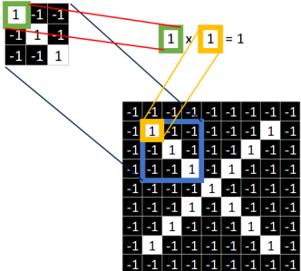
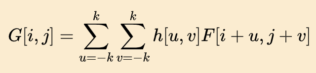
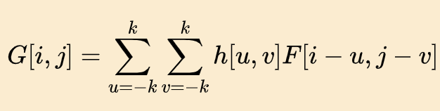
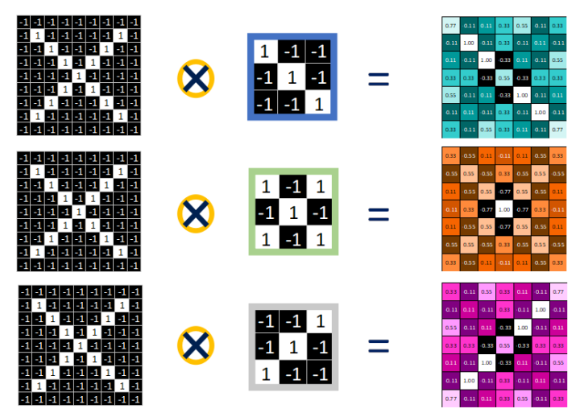
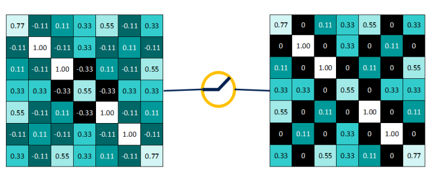
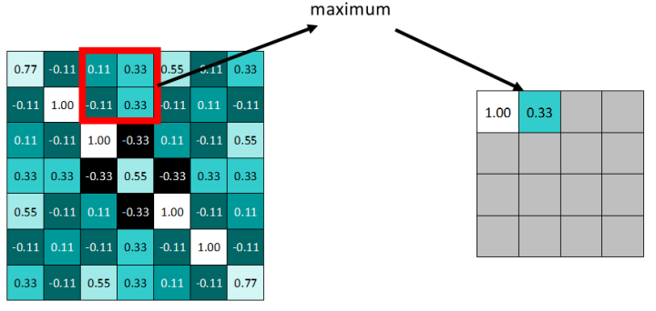
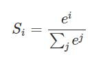
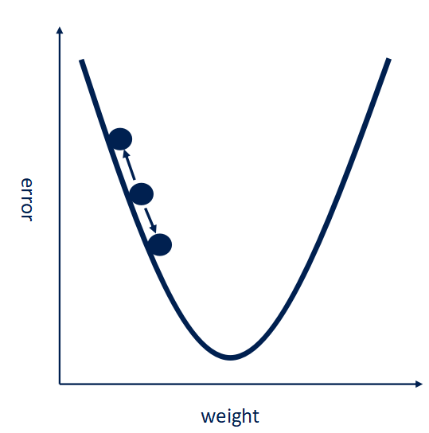

# A Simple Way to Understand Convolutional Neural Network

## Outline
1. Introduction
2. Main layers in CNN
   1. Convolutional layer
   2. Active layer
   3. Pooling layer
3. Hiddne layers
4. Gradient Descedent
5. Deep Neural Networks
6. Feedforward VS. recurrent network
7. Back Propogation Neural Networks
8. How to train a neural network
   1. Before training
   2. During training
   3. After training

## Introduction
Fully connected neural networks are like a logistic regression. We need to assign weight for each node in network and linear combine the results of node. And then we need to use an non-linear activation function to activate the results.
This article mainly focuses on the understanding of CNN.
Nowadays, CNN has been used in all kinds of field, region segmentation, style conversion. All the applications are based on CNN. And the function of CNN is extracting the features in images.

## Main Layers in CNN
In the common CNN we use, the first three layers can be stacked.
### Convolutional Layer
We can use features as filters in CNN to compute the correlation between feature template and image. And detect the features in image.

#### The difference between convolution and cross-correlation
We usually use cross correlation between images to compute the correspondences between features points in computer vision.   Cross correlation is like dot product of template/feature/filter and image window. The elements muiltiply each other in the same position.

But we can see the results of cross-correlation are like the filters but with filpping.
So we use convolution to compute the correlation between filter and image window. Convolution means first flip filter and then muiltiply elements.
In this way, we can get results similar to the filter and can detect the features in image directly.

The results of convolution and cross correlation are the same when the filter is symmetri c w.r.t x-axis and y-axis. For example, average filter and Gaussian filter.
#### The results of convolutional layer
The results of convolutional layer is new images called feature map.
The window in the image is moving after each time convolution. The moving translation depends on stride. For example, if stride = 1, the window moves 1 pixel each time.

#### Padding
Sometimes, the original image is too small. So, the feature map is very small. The information we gain is limited and some information is lost. 
So we can use padding to add pixels with value 0 around the image.

1.  The goal of padding is to make feature map larger but no larger than original image size.
2. The uppper bound of padding is to make feature map the same size as original image.
3. The number of padding depends on the filter size and stride size.
4. All the pixels we add by padding is 0.
5. Function to compute padding: (n+2p-f)/s+1
   1. n: original size(length, width)
   2. p: Padding
   3. f: filter size(length, width)
   4. s: stride value

### Activation layer
The non-linear activation layer activate the results of convolution layer in a non-linear way.
By using this layer, we can get less data and remain all the useful information and discard all the useless and uncorrelated information.

#### Why we need to use non-linear activation
The previous layers' results are already the linear combination of input. If we still use linear activation function or we don't use activation function, the result of neural network is very limited. Because in this way, the neural network is the original perceptron.
  So, we want to invoke non-linear function as activation function. And the neural network will be more powerful. It can approach amost all kinds of functions.
#### Early activation functions
1.  Sigmoid Function

This function can convert input into [0,1] output and -∞ =>0, ∞->1
In back Propogation, the gradient may be lost(more likely) or explode.
Can't have 0 mean output
2. Tanh Function

Gradient vanishing still exists in this function.
3. ReLU Function
f(x) = max(0,x)
Remain x when x > 0, change to 0 when x < 0
Almost solve all the problems in the previous functions. But still non-zero mean.
May have Dead ReLU Problem, some nodes may not be activated forever and the parameters related will never be updated. This because learning rate is too high. So, we can adjust learning rate or set it lower.

### Pooling Layers
Max Pooling layer and Average pooling layer. Max pooling pick the max value within window. Average pooling picks the avg value of the window.

### Fully connected Layer
Fully connected layer is like eedforward neural network or multilayer perceptron(MLP).
After convolution, relu and pooling, the results are a couple of images. The fully connected layer is to combine the results into a conclusion. And gives the probabilities of each previous output.
'''Partial connection and sharing parameters are the most important porperties of CNN.'''
#### Softmax Function

The output is in (0,1). Higher input has much higher output, lower input has much lower output. And we can compute derivative of softmax consecutively.
#### How to use Softmax
Softmax compute the probabilities of each label. And the highest probability relates to the final result.

## How to train and optimize neural networks
### Train the filter(kernal)
#### Back Propogation and Gradient Descedent
By assign random values into filters, and start training. Input with a labeled images, and compute error by error = (result-label)^2.
If we want the make error be less and less. We can use gradient Descedent. We need to change the weight parameters in convolutional layers so that the gradient Descedent into minimum.

